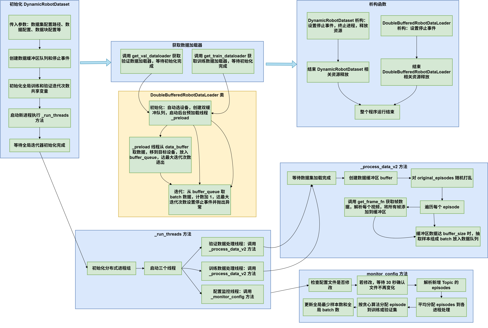

### internal implementation for datasets

#### install
需要安装torchcodec，安装方法参考[torchcodec](https://github.com/pytorch/torchcodec?tab=readme-ov-file#installing-torchcodec), 注意要选择和torch版本匹配的torchcodec版本：
```
pip install torchcodec
```

然后安装x2robot_dataset
```
pip install -e .
```

### usage
- Use `make_chunk_dataset` from `map_dataset.py` to create map-like dataset
- Use `make_interleave_dataset` from `iterable_data.py` to create iterator-like dataset
- Use `lazy_dataset.py` to create lazy dataset  

check out `./tests` for more examples, for example, `test_lazy_dataset.py` and `./tests/test_image_video_x2_mix.ipynb`


> 🚨 **使用须知** 🚨
> 
> 1. Accelerator需要设置`dispatch_batches=False`
> 
> 2. Dataloader设置`num_workers=0`
> 
> 3. 如果遇到内存超限，尝试调低preload_pool_size / num_preloader_threads / max_frame_buffer_size /num_frame_producer_threads 
>
> 4. 在train loop结束后，val loop开始前，需要调用`val_dataloader.dataset.dataset.reset_epoch(epoch)`
>
> 5. 当使用gradient_accumulation_steps>1时，设置train_loop_break_step = int(train_num//gradient_accumulation_steps)*gradient_accumulation_steps，并在train loop中在train_loop_break_step后跳出
>
> ⚠️ 4和5是暂时的workaround，欢迎探究根本原因&修复

（待废弃，请使用下面的最新数据集）
----

# Dataset V3

## 简介

面向机器人多模态训练的轻量级数据集解决方案，支持多视角视频、动作序列和传感器数据的联合加载，提供高效的数据预处理和分布式训练支持。相比上一代的数据集，有大量的huggingface pytorch原生类依赖，新的dataset构建了一套完善且简单的流程，以Topic为数据配置的基本单元，以Episode作为数据处理的基本单元，聚合了许多操作并大量缩短了数据流水线。

## 核心功能

• 👥 ​​子进程并行数据加载与数据处理​

• ⚖️ ​​动态数据分布平衡​

• ✅自动帧校验与📦​元数据缓存​

• 🔌​即插即用式分布式训练支持​


## 运行逻辑图



## 基本用法

如果需要在基本的DP模型上使用，可以参考Diffusion Policy仓库下的两套任务的配置文件和运行脚本：

1、entangle line threefork:

```text
diffusion_policy/config/task/entangle_line_threefork.yaml
diffusion_policy/config/entangle_line_threefork.yaml
slurm_scripts/entangleline.sh
```


2、pick cup car:

```text
diffusion_policy/config/task/pick_cup_car.yaml
diffusion_policy/config/pick_cup_car.yaml
slurm_scripts/pick_cup_car.sh
```

如果需要适配其他的训练框架，可以自行适配。

自行适配可以参考示例测试代码`tests/test_dynamic_robot_dataset.py`，，使用方法请参考`tests/README.md`

数据集流程不清晰或者有修改需求，请联系 @Starrick。

